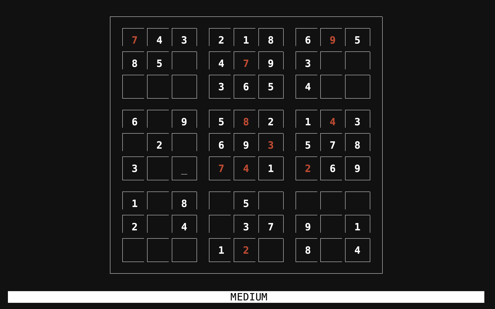

# Terminal Sudoku
Full Sudoku game playable in the command line.

 

Generate, solve and play easy, medium, and hard board difficulties.

## Installation
`$ git clone https://github.com/dnellessen/terminal-sudoku.git`\
or download ZIP.

If you want to run the game from any directory, I'd suggest creating an alias\
`$ alias sudoku='python3 /path/to/directory/main.py'`\
and [making it permanent](https://fedingo.com/how-to-create-permanent-alias-in-linux/).

## Usage
You can pass in the difficulty of the board when starting the game with an argument.

`$ sudoku -e[asy]`\
`$ sudoku -m[edium]`\
`$ sudoku -h[ard]`\

### In-Game

To move the cursor on the board, use the arrow keys or WASD.
To remove a number from the board enter '0'.

Commands can be entered from the status bar. Press ':' to activate it.
- `:q[uit]`   ->  Quit game.
- `:c[heck]`  ->  Check whether to board has been solved and marks errors (immutable afterwards).
- `:s[olve]`  ->  Solve board and visualize the backtracking algorithm.
- `:e[asy]`   ->  Switch to an easy board.
- `:m[edium]` ->  Switch to a medium board.
- `:h[ard]`   ->  Switch to a hard board.

To exit the status bar and return to the board press the escape key.

Be careful when trying to resize your window. If it happens too quickly or the window
gets too small (min. 25 rows and 50 columns), the game will quit and the board will be lost.

